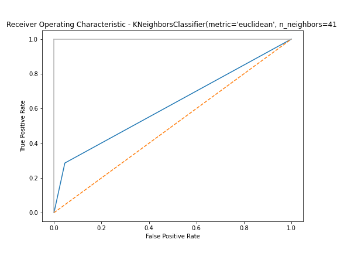

# Challenge_Classification
challenge classification becode

## Challenge

Use the Classification strategy to gather and preprocess data, Choose a model, Training it and evaluate it. And also use the Tuning of hyperparameters to make the best Machine Learning prediction.

## Duration
this challenge tooks 3 days

## Objectif

In this project, we learn to implement different classification algorithms in Python.    
At the end of the challenge, you will be able to:

    - Choose the most appropriate algorithm, depending on the problem.   
    - Know the know-how, way to implement and logic behind most common classifiers.   
    - Manipulate different type of data.   

## Proprocessing and Classification

As we mentioned it, the first steps consist to gather, clean and preprocess the data.   
This, you can find it in the [main](main.ipynb) notebook.   
In this [main](main.ipynb) notebook also we define functions for the Machine learning process:   
   -  Classification   
   -  grids   
   -  metric   

And then, for every classification model, we use a differrent notebook and always importing [main](main.ipynb) in it.
We use here six models:   

### 1- Logistic Regression   

   
  
View detail
    

Score with defaults value:  
  * Train set: 0.808   
  * Test set:  0.819   

ROC Curve:   

Score with best model:
  * Train set: 0.808     
  * Test set:  0.819   

ROC Curve:   

  
View detail
   

   

   

Metrics:   

  
View detail
   

   

   
 

### 2- Decision Tree   

   
  
View detail
    

Score with defaults value:  
  * Train set: 1.000  
  * Test set:  0.735

ROC Curve:  

  
View detail
   

.png)   

   

Score with best model:
  * Train set: 0.820     
  * Test set:  0.826   

ROC Curve:

  
View detail
   

.png)   

   
 

Metrics:   

  
View detail
   

   

   
   

### 3- Random Forest   

   
  
View detail
    

Score with defaults value:  
  * Train set: 1.000   
  * Test set:  0.824   

ROC Curve:  

  
View detail
   

.png)   

   

Score with best model:
  * Train set: 0.844     
  * Test set:  0.829   

ROC Curve:

  
View detail
   

   

   

Metrics:   

  
View detail
   

   

   

### 4- KNeighbors   

   
  
View detail
    

Score with defaults value:  
  * Train set: 0.843   
  * Test set:  0.789   

ROC Curve:  

  
View detail
   

.png)   

   

Score with best model:
  * Train set: 0.816     
  * Test set:  0.810   

ROC Curve:

  
View detail
   

   

   

Metrics:   

  
View detail
   

   

   
   

### 5- SVC   

   
  
View detail
    

Score with defaults value:  
  * Train set: 0.824   
  * Test set:  0.826   

ROC Curve:  

  
View detail
   

.png)   

   

Score with best model:
  * Train set: 0.833     
  * Test set:  0.825   

ROC Curve:

  
View detail
   

   

   
  

Metrics:   

  
View detail
   

   

   
   

### 6- GaussianNB   

   
  
View detail
    

Score with defaults value:  
  * Train set: 0.688   
  * Test set:  0.686   

ROC Curve:  

  
View detail
   

.png)   

   

Score with best model:
  * Train set: 0.806     
  * Test set:  0.806   

ROC Curve:

  
View detail
   

.png)   

   

Metrics:   

  
View detail
   

   

   

## The best model

After testing those six models, we can see that:   
    - if we use only default values, most of time we have an overfit. Training score is 100% percent but Testing score is far less (60 to 80)   
    - if we tune parameters by using gridsearchCV the Training score is reduced but we get higher Testing score.   
So if we refer to the best parameters, we can conclude that [Decision_tree](Decision_tree.ipynb), [Random_forest](Random_forest.ipynb) and [SVC](svc.ipynb) are the best models for this cleaned dataset.   

## Author
This is an individual project given by our caoch at BeCode.
So I do it lonely and you can also fork or download it for your own work.   

Feedbacks are always welcome ;)
